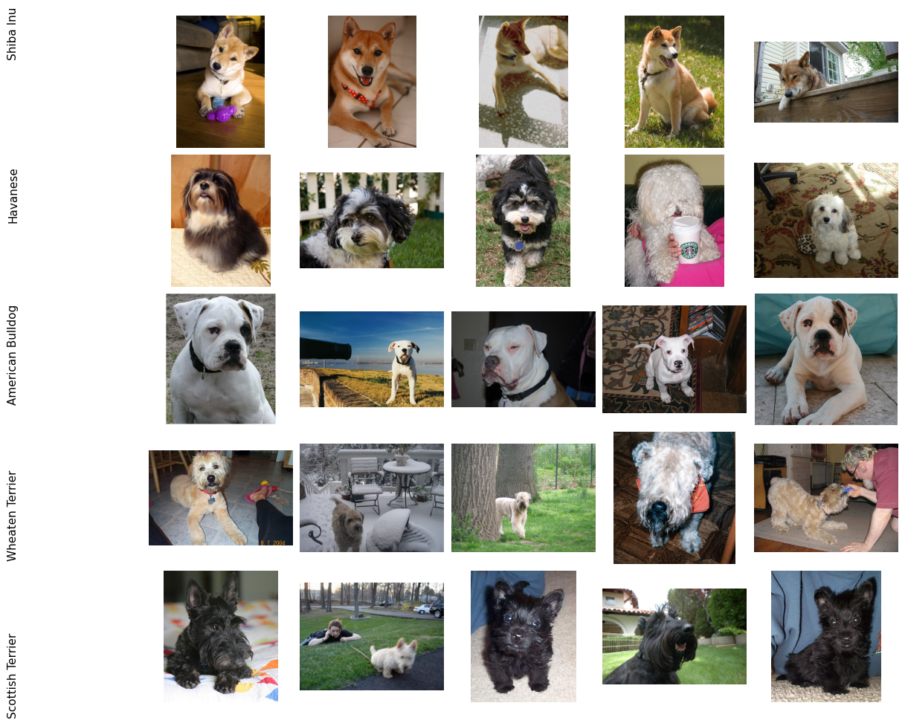
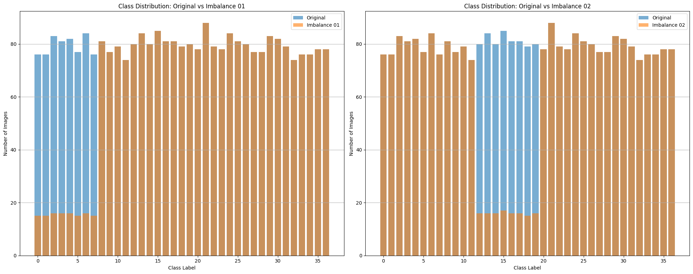
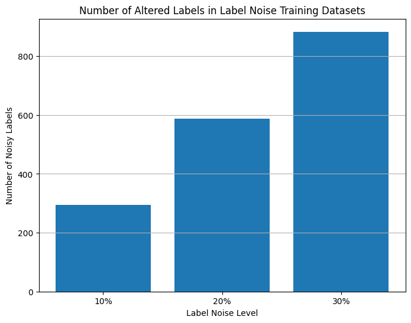
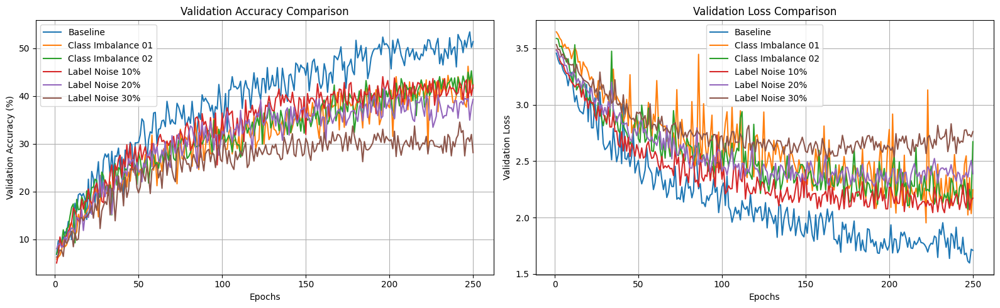
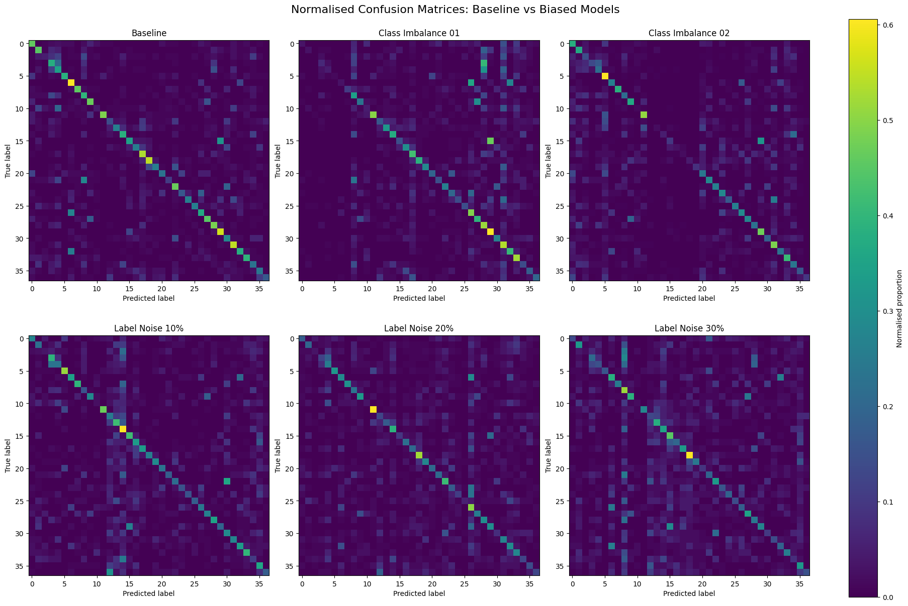
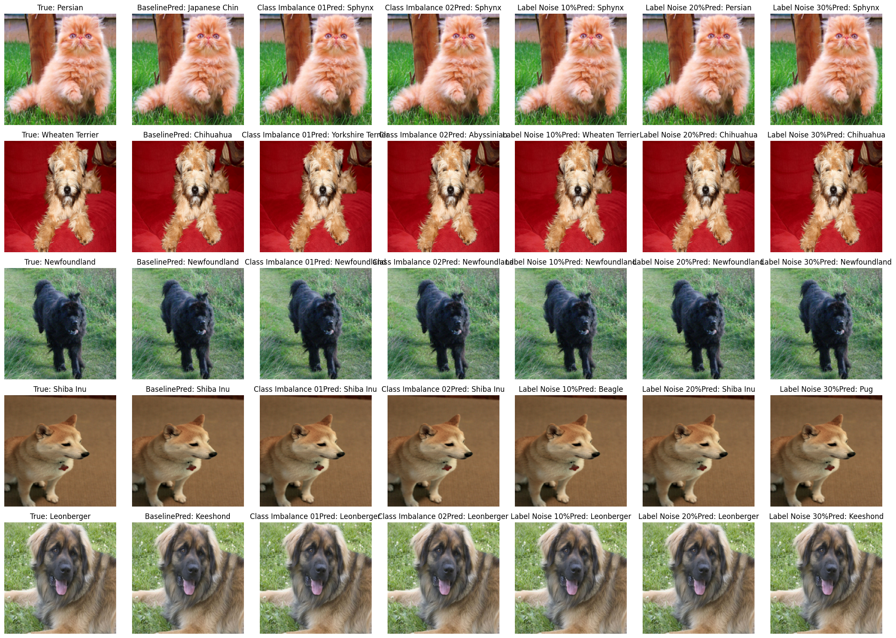

# PetNet🐶🐱 
The Impact of Training Data Bias on CNN-Based Classification

This project investigates how class imbalance and label noise affect image classification performance using the Oxford-IIIT Pet dataset and a custom PyTorch convolutional neural network.

The dataset was split into:

- Training set

- Validation set

- Test set

The test set was kept completely separate and used only for final evaluation.
## Dataset Samples



## Installation
```bash
pip install -r requirements.txt
```

## Running the Project
```bash
jupyter notebook main.ipynb
```

## Model Design
1. Develop a convolutional neural network (PetNet) for multi-class pet image classification.
2. Introduce controlled training data biases.
3. Compare the effects of class imbalance and label noise.
4. Evaluate how these biases affect model generalisation.


## Training Parameters

| Parameter | Value |
|--------|--------:|
| Batch Size | 32 |
| Num Workers | 2 |
| Learning Rate | 0.0005 |
| Optimizer | Adam |
| Epochs | 250 |
| Weight Decay | 5e-4 |
| Dropout | p = 0.5 |
| Loss Function | CrossEntropyLoss |


## Bias Experiments

### 1）Class Imbalance
Two biased training datasets were created by reducing the number of samples in selected classes.

### 2）Label Noise
Three biased training datasets were created by randomly replacing:
- 10%/20%/30% of labels


## Evaluation Methods

Models were evaluated using:

- Accuracy

- Macro Precision

- Macro Recall

- Macro F1-score

- Weighted F1-score

- Validation accuracy and loss curves

- Confusion matrices

- Inference visualisation

## Key Results
(tabels)

```bash
model_performance.csv
test_evaluation.csv
```
(images)

Validation Curves



Confusion Matrixs



Inference Visualisation (randomly select 5 test images)



## Repository Structure
```text
PetNet/
├── main.ipynb
├── README.md
├── requirements.txt
├── .gitignore
├── figures/
├── logs/
└── results/
```

## Conclusion
This project demonstrates that training data quality has a substantial impact on image classification performance. Both class
imbalance and label noise impaired model generalisation, with severe label noise producing the largest reduction in performance.

## Authors
Jialing Wang, Jianan Ding

MSc Medical Physics in Cancer Radiation Therapy

University of Manchester
